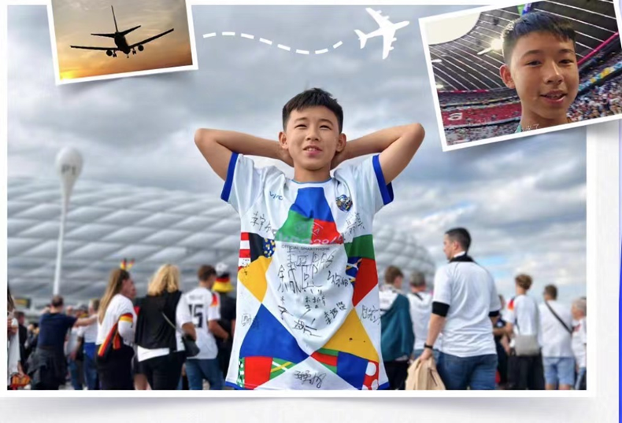
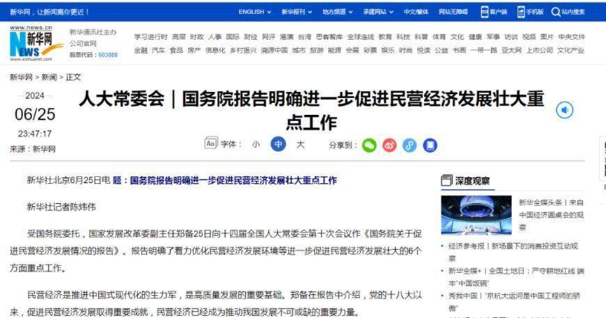

# 新闻资讯

## 一、	体育资讯

**贵州村超少年圆梦欧洲杯**

从中国到德国，需要跨越7224公里的距离。从村超到欧洲杯，却只要心存热爱便可抵达。12岁的村超少年赖勋翔，做梦都没有想到有一天可以亲临欧洲杯现场观看比赛。
小赖带着队友的梦想，带着全村的热爱奔赴欧洲杯，他要告诉全世界的人，自己出生在一个热爱足球的地方。无论距离多远，有热爱终将抵达。

赖勋翔是黔东南苗族侗族自治州榕江县古州二小六年级学生，也是校足球队员。他从8岁开始进入校队踢球，一直都是前锋。课余时问，赖勋翔都“泡”在学校练球，
训练内容包括熟练颠球、踢球、运球等。赖勋翔说：“能现场观看四年一度的欧洲杯很激动。我希望通过这次机会，让更多的人认识我美丽的家乡榕江。”

赖勋翔从1岁开始跟足球结缘。年幼的赖勋翔从小就跟着爸爸在球场上玩，看爸爸踢球。但赖勋翔喜欢足球，不是因为爸爸，而是因为这个地方的人都热爱足球。在榕江县，
几乎每个村都有自己的足球队，足球赛是名副其实的“全民参与”。耳濡目染下，赖勋翔与足球结缘。看着大街小巷的村超元素，赖勋翔想到了一个绝妙的点子。
他用丁恤搜集大家的签名，准备穿着这件T恤前往梦欧洲杯。他想带上作业，带上奶奶的笑容，带上队友的梦想，带上全村的热爱，带上大家的祝福，去到更远的地方。
他要告诉全世界的人，自己出生在一个热爱足球的地方。

赖勋翔坐上出发德国的飞机，顺利抵达欧洲杯现场。在这里，他欣赏着职业球员的球技，聆听着世界各地球迷的呐喊，感受着欧洲杯热烈的氛围。
在足球的世界里，没有年龄，没有国籍，对足球的热爱拉进着每一个人的距离。村超之所以火，是因其承载着普通村民对足球的纯粹热爱，无专业球员却有执着追求，独特的民族风情与足球融合，魅力独具。

同时因为村超的火爆，游客大量涌入，从而带动了本地餐饮、住宿，特色农产品的销量。村超不仅是赛事，更是乡村振兴的助推器，让乡村重新焕发生机。24支球队，
51场比赛，一个夏天的激情，欧洲杯我们看的不止是足球，也是人生百态。从中国到德国，需要跨越7224公里的距离。从村超到欧洲杯，却只要心存热爱便可抵达。

未来，赖勋翔会继续踢球，榕江人也会继续爱着足球，世界也会记住每一份足球梦。

## 二、	财经资讯

**国务院报告明确 进一步促进民营经济发展壮大重点工作**

受国务院委托，国家发展改革委副主任郑备25日向十四届全国人大常委会第十次会议作《国务院关于促进民营经济发展情况的报告》。
报告明确了着力优化民营经济发展环境等进一步促进民营经济发展壮大的6个方面重点工作。

数据显示，2012年到2023年，民营企业占全国企业总量由79.4%提高至92.3%，个体工商户由4000余万户增加至1.24亿户。2012年到2023年，民营企业进出口额年均增长11.1%，
占全国进出口总额的比重由30%左右增长至50%以上。2019年开始，民营企业成为我国第一大外贸经营主体。

当前，民营经济发展壮大具备坚实支撑和独特优势。报告指出，综合国力显著提升为民营经济发展奠定坚实基础，深层次改革和高水平开放为民营经济发展注入强大动力，
科技革命和产业变革为民营经济提质升级带来新机遇，综合统筹力度加大对民营经济发展形成有力支撑。

报告同时指出，民营经济发展仍面临一些问题和挑战。市场准入和要素获取等方面矛盾仍较突出，民营企业产权和企业家权益保护还不充分，政策落实和服务供给还存在短板，有的地方政务诚信建设有待加强，
企业账款“连环欠”问题尚需解决。有的民营企业发展方式粗放，管理不规范，现代企业制度建设滞后。

**围绕进一步促进民营经济发展壮大，报告提出了6个方面的重点工作：**

一是着力优化民营经济发展环境。推动各类经营主体依法平等进入负面清单之外的行业、领域、业务。

二是着力加大民营经济发展要素支持。加大对民营企业的信贷投入，健全风险分担和补偿机制，支持符合条件的民营企业上市融资和再融资。

三是着力强化民营经济发展法治保障。推动加快制定民营经济促进法。防范不当立案、选择性执法司法、趋利性执法司法或地方司法保护。

四是着力加强政策协调和督导落实。清理涉及不平等对待企业的法律法规政策，在宏观政策取向一致性评估中对涉民营经济政策开展专项评估。持续拓宽民营企业参与政府决策渠道。

五是着力推动民营企业加强能力建设。引导企业完善治理结构和管理制度。

六是着力营造关心支持民营经济发展的社会氛围。规范涉民营经济信息传播秩序，常态化开展优化营商网络环境工作，批驳蓄意炒作、造谣抹黑民营企业和民营企业家言论。

## 三、	娱乐资讯

新浪娱乐讯 6月16日，2024微博电影之夜圆满落幕，张艺谋获杰出贡献导演，费翔、章子怡获影响力电影人；黄渤、黄晓明、马丽获年度榜样演员；
大鹏获年度质感导演，王俊凯获年度质感演员；年度突破电影人由刘伟强、王一博获得；《第二十条》《飞驰人生2》《封神第一部：朝歌风云》《热辣滚烫》《涉过愤怒的海》获年度影片；
年度瞩目影片是《传说》《水饺皇后》《一个男人和一个女人》；年度特别推荐影片分别是《蛟龙行动》《解密》《异人之下》。

陈昊宇、黄曦彦、刘耀文、娜然、王影璐获得“年度进取演员”荣誉，演员蒋勤勤上台见证。

胡先煦、李庚希、刘浩存、屈楚萧、文淇、周也获得“年度表现力演员”荣誉，出品人、制片人梁静上台见证。

黄轩、倪妮获得“年度品质演员”荣誉，导演刘伟强上台见证。

## 四、	社会资讯

**关于2024年高考志愿填报，教育部发布十问十答**

据教育部官微消息，近日，各省（区、市）正陆续发布2024年高考成绩，并即将启动高考志愿填报工作。为更好地帮助广大考生和家长了解高考志愿填报相关事项，教育部整理了一些常见问题，供考生和家长参考。

**问：在哪里可以了解高考成绩、志愿填报时间和方式、各高校招生计划、往年录取参考等志愿填报权威信息？**

**答：** 各省级教育行政部门或招生考试机构官方网站、微信公众号等权威渠道都会公布今年高考各阶段工作时间安排，包括高考成绩公布时间和查询方式、志愿填报时间，以及今年各高校招生计划、往年录取情况参考等权威信息。考生和家长要及时关注本地官方权威渠道发布的消息内容。

**问：高校招生章程有什么作用，如何查询？**

**答：** 考生在填报志愿前，应仔细查阅拟报考高校的招生章程，全面了解高校招生办法和相关招生要求。主要查询途径有：中国高等教育学生信息网的“阳光高考”信息平台（https://gaokao.chsi.com.cn）；各高校官方招生网站等。

**问：高考招生有哪些投档录取模式？**

**答：** 高考投档录取模式由各省级招生委员会确定，一般有两种模式：平行志愿投档录取和顺序志愿投档录取。

平行志愿投档录取模式，采用“分数（位次）优先、遵循志愿”的原则。先按照考生高考成绩从高到低进行排序，再依据考生填报的平行志愿顺序、结合高校招生计划和投档比例依次进行检索，当检索的志愿有投档缺额时即进行投档，投档成功后不再检索填报的后续平行志愿。

顺序志愿投档录取模式，也称为梯度志愿投档录取模式，采用“志愿优先、遵循分数”的原则。即同一批次允许考生填报若干个按顺序排列的志愿，通常称为第一志愿、第二志愿、第三志愿等。在第一志愿投档时，凡第一志愿填报相同的考生，遵循从高分到低分按投档缺额进行投档；第一志愿投档录取完毕后，如所填报志愿有投档缺额，进行第二志愿投档录取。依此类推。

**问：填报志愿时有哪些注意事项？**

**答：** 一是牢记填报时间，尽早进行填报。考生务必在规定时间内填报志愿，填报志愿系统按照规定时间关闭，关闭后考生将不能再填报。二是增强防范意识，管好个人信息。考生应妥善保管好自己的身份证号、考生号等个人信息和志愿填报系统密码等登录信息，不要泄露给他人，防止志愿被他人篡改。三是勿信小道信息，谨防上当受骗。社会上一些机构或个人开展的各类志愿填报咨询活动存在政策解读不准确、信息提供不真实、费用收取不规范甚至诈骗等问题。

## 五、	科技资讯

Omdia：售价低于150美元的低端智能手机需求激增

    最新的《Omdia智能手机型号市场跟踪报告》显示，低端价格区间产品在所有类别的智能手机中增长速度最快。售价低于150美元的手机同比增长3000万台，从2023年第一季度的9000万台增至2024年第一季度的1.2亿台，涨幅达33%。值得注意的是，售价为90美元或更低的超低成本手机展现出令人瞩目的同比增长势头，从2023年第一季度的1800万台增至2024年第一季度的3400万台，涨幅达87%。

推动这种增长的一个重要因素是中端手机购买者的趋势：要么升级到更高端的型号，要么降级到更实惠的低端手机。Omdia的消费者调查显示，新兴市场的智能手机更换周期短于发达国家。Omdia智能手机研究团队高级分析师Aaron West解释说：“这是因为廉价智能手机性能表现不佳，而且它们的安全和操作系统支持周期较短。随着OEM厂商在印度等国家推出新的低价机型，不断扩大的新兴市场对于低端智能手机的需求也稳步增加。”

2023年初，售价在151美元到600美元之间的中端手机需求显著下降，至今尚未恢复。在2024年第一季度，该类手机的出货量为1.07亿台，比2023年第一季度的1.09亿台减少了200万台。如图1所示，这一长期趋势显示，近年来中端领域呈现同比负增长趋势，而低端领域自2023年第一季度以来呈现正增长的趋势，高端领域自2023年第三季度以来也有所增长。

包括售价高于600美元的手机在内的高端领域也呈现了同比增长的趋势。在2024年第一季度，这一领域相较2023年第一季度增加了300万台，从7000万台增长到7300万台。这种增长趋势在全新三星Galaxy S24系列中表现明显，该系列于2024年1月24日发布，其本年第一季度的总出货量达到了1430万台。该数字与去年的S23系列相比有所增加，S23系列在2023年第一季度的出货量为1180万台。

所有这些迹象表明，智能手机市场日益呈现出两极分化的趋势：一方面是主要集中在新兴市场的低端消费者，另一方面则是发达市场的高端智能手机消费者。

